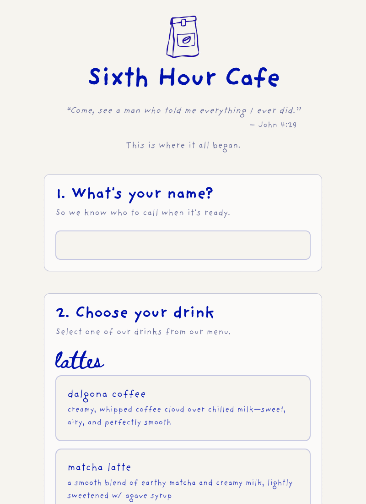

# Sixth Hour Cafe Queue

**Live demo: [sixth-hour-cafe-queue.vercel.app](https://sixth-hour-cafe-queue.vercel.app)**

A real-time cafe order management system built with Next.js and Firebase — designed for a two-screen workflow where customers place orders on one iPad and staff manage the live queue on another.



Originally built for **Sixth Hour Cafe**, an Anchor Christian Fellowship at MSU pop-up cafe. This project was developed end-to-end as a personal project to solve a real operational problem: tracking handwritten drink orders is error-prone and slows down service during busy rushes.

---

## What it does

It's **multi-tenant**: anyone can sign up, get their own isolated cafe, and share a public ordering link with their customers.

**Landing (`/`)** — Product intro with links to sign up / log in.

**Sign in (`/login`)** — Owners create an account or sign in with email/password or Google. New owners complete a quick setup (`/onboarding`) choosing a cafe name and a unique public link slug.

**Customer screen (`/order/[slug]`)** — Customers open a cafe's public link (or scan its QR), tap their name, select drinks and modifications, and submit. No login required. The order appears on that cafe's staff screen in real time.

**Staff queue (`/staff`)** — The signed-in owner sees their own pending orders as cards, with animated transitions when orders arrive or are completed. Completed orders move to an archived history. A "Customer link" button copies the shareable ordering URL.

**Menu management (`/staff/menu`)** — Owners add/remove drinks, update descriptions, mark items out-of-stock, reorder items, and manage categories and modifiers — all scoped to their own cafe, with auto-save and real-time sync.

---

## Technical highlights

- **Multi-tenant data isolation** — Every cafe's data lives under `cafes/{cafeId}/…` where `cafeId` is the owner's Auth uid. Firestore Security Rules enforce that owners can only read/write their own cafe, while menus stay publicly readable for customers.
- **Real-time sync** — Firestore `onSnapshot` listeners push order and menu updates to every connected screen instantly, with no polling.
- **Optimistic UI** — Menu changes reflect in the UI immediately and save to Firestore in the background, with a visible auto-save status indicator.
- **Authenticated client writes** — Owner mutations run client-side as the authenticated owner; Security Rules (not server code) are the trust boundary. Customers order via an anonymous session.
- **Abuse protection** — Firebase App Check (reCAPTCHA v3) guards the public order-creation endpoint, and Security Rules validate the order shape and size.
- **Environment-variable-validated config** — Firebase credentials are validated at startup so misconfigured deployments fail fast with a clear error rather than silently at runtime.
- **Animated order cards** — Framer Motion drives entrance, exit, and state-transition animations on order cards for a polished staff-facing UX.

---

## Tech stack

| Layer | Choice |
|---|---|
| Framework | Next.js 16 (App Router, Turbopack) |
| Language | TypeScript |
| Database | Firebase Firestore |
| Auth | Firebase Authentication |
| Styling | Tailwind CSS + Radix UI primitives |
| Animation | Framer Motion |
| Forms | React Hook Form + Zod |
| Deployment | Vercel + Firebase App Hosting |

---

## Project structure

```
src/
  app/
    /               — Landing page
    /login          — Owner sign in / sign up (email + Google)
    /onboarding     — First-time cafe setup (name + public slug)
    /order/[slug]   — Public customer ordering screen (per cafe)
    /staff          — Owner queue dashboard (auth-gated)
    /staff/menu     — Menu and category management (auth-gated)
  components/       — UI components for customer and staff flows
  lib/
    data.ts         — Server-side public reads (slug → cafe, menu)
    cafe-paths.ts   — Cafe-scoped Firestore path helpers + slug validation
    definitions.ts  — Shared TypeScript types
  firebase/         — Firebase init, App Check, auth helpers, React provider
scripts/
  migrate.ts        — One-time legacy → multi-tenant data migration (Admin SDK)
```

---

## Local setup

### Prerequisites

- Node.js 18+
- A Firebase project with Firestore and Authentication enabled

### Install

```bash
npm install
```

### Configure environment

```bash
cp .env.example .env.local
# Fill in your Firebase project credentials
```

### Run

```bash
npm run dev        # Starts at http://localhost:9002
npm run build      # Production build
npm run typecheck  # Type check without emitting
npm run lint       # ESLint
```

---

## Firestore data model

Each cafe owns an isolated subtree under `cafes/{cafeId}`, where `cafeId === the owner's Auth uid`. A top-level `slugs` collection maps public slugs to cafes for customer links.

| Path | Fields |
|---|---|
| `cafes/{cafeId}` | `name`, `slug`, `createdAt` |
| `cafes/{cafeId}/orders/{id}` | `customerName`, `items[]`, `status` (`pending` / `completed` / `archived`), `createdAt` |
| `cafes/{cafeId}/drinks/{id}` | `name`, `description`, `category`, `inStock`, `order`, `modifications[]` |
| `cafes/{cafeId}/categories/{id}` | `name` |
| `cafes/{cafeId}/counters/{id}` | all-time drink totals |
| `slugs/{slug}` | `cafeId` |

Access is enforced by [`firestore.rules`](firestore.rules): cafe info, menus and categories are publicly readable; orders can be **created** by anyone (validated shape) but only **read/managed** by the owner; all writes to a cafe require `request.auth.uid == cafeId`.

---

## Deployment

The app is deployed on Vercel with Firebase as the backend. To deploy your own instance:

1. Create a Firebase project and enable Firestore + Authentication.
2. In **Authentication → Sign-in method**, enable **Email/Password** and **Google**, and add your domain under **Authorized domains**.
3. Deploy the security rules and indexes:
   ```bash
   firebase deploy --only firestore:rules,firestore:indexes
   ```
4. (Recommended) Enable **App Check** with reCAPTCHA v3, enforce it on Firestore, and set `NEXT_PUBLIC_RECAPTCHA_SITE_KEY`.
5. Add the variables from `.env.example` to your Vercel project settings.
6. Push the repo — Vercel builds and deploys automatically.

### Migrating existing single-cafe data

If you're upgrading from the original single-cafe version, run the one-time migration to move legacy top-level collections into your new account. See the instructions in [`scripts/migrate.ts`](scripts/migrate.ts).

---

## Background

This project started as a practical tool for a real cafe and grew into a full-stack exercise in building a production-quality real-time web app from scratch — including data modeling, UI/UX decisions for touch screens, deployment configuration, and iterative feature development based on actual use.
